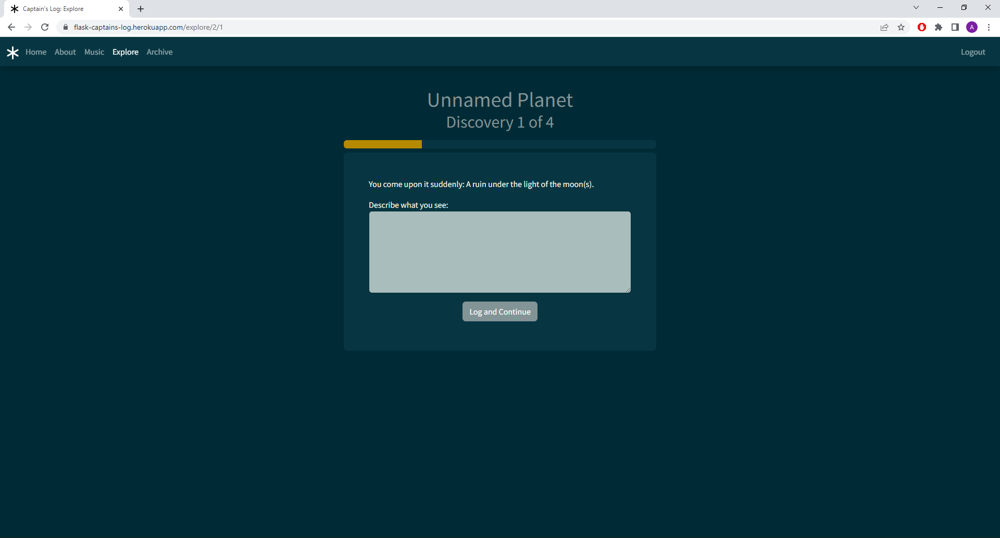
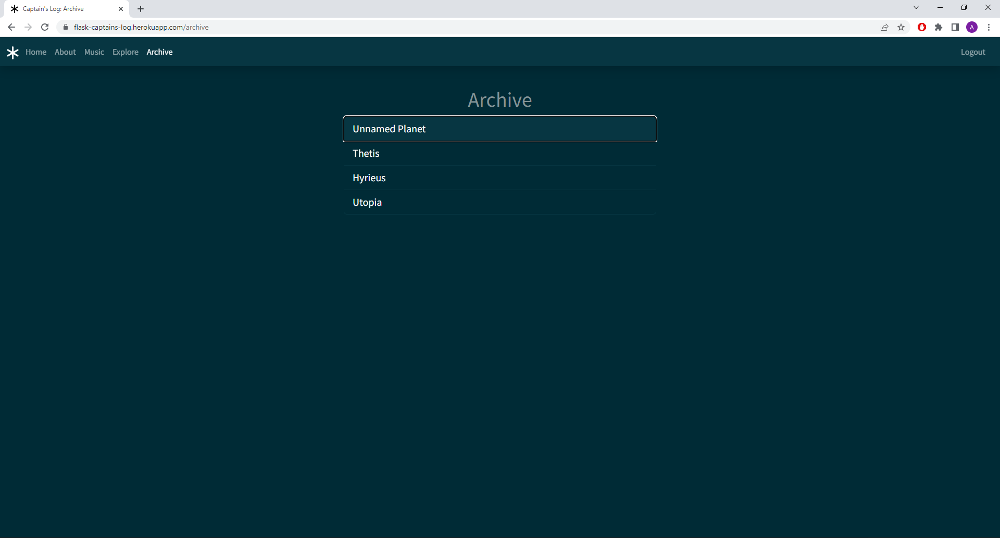
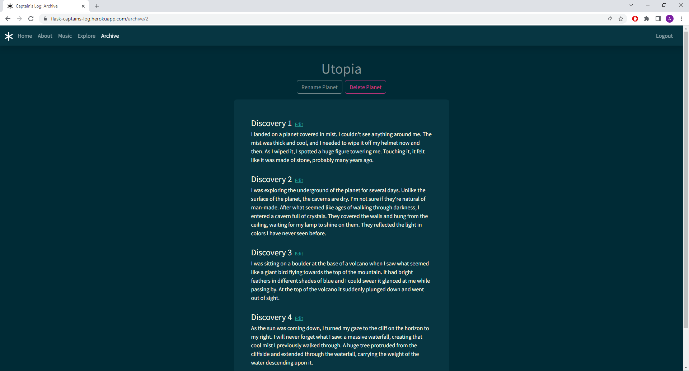

# Captain's Log
> An adaptation of a solo role-playing game built in Flask.
> Live demo [here](https://flask-captains-log.herokuapp.com/).

## Table of Contents
* [General Info](#general-information)
* [Technologies Used](#technologies-used)
* [Features](#features)
* [Screenshots](#screenshots)
* [Setup](#setup)
* [Usage](#usage)
* [Acknowledgements](#acknowledgements)


## General Information
Captain's Log is a web app where users can log their adventures while playing Takuma Okada's role-playing game [_Alone Among the Stars_](https://noroadhome.itch.io/alone-among-the-stars). In this game, you play a lone explorer, hopping from planet to planet while recording your discoveries in a journal. It is a game of creative writing and solitary self-reflection.

Each planet houses 1 to 6 things to discover, represented in the game by a six-sided die. The prompt for each discovery is randomized by a standard deck of cards. The explorer keeps rolling dice and drawing cards until they are ready to go back home.

This web app is intended to function as your captain's log during your travels. You can log your descoveries and review them in the archive.


## Technologies Used
- HTML
- CSS
- JavaScript
- Bootstrap
- Flask
- Flask Extensions: Flask-WTF (WTForms), Flask-Login, Flask-Mail
- PostgresSQL, SQLAlchemy
- Deployed on Heroku


## Features
- CRUD operations with RESTful routes
- User authentication and sessions
- In-game state of the user stored in database
- Fully responsive design
- Password reset email
- Flask Blueprints and Application Factory pattern


## Screenshots
<p align="center">
  
</p>
<p align="center">
  
</p>
<p align="center">
  
</p>


## Setup
To run locally:
1. Clone repository:
```
git clone https://github.com/alon-pilosoph/captains-log.git
```
2. Create a new virtual environment:
```
python3 -m venv venv
```
3. Activate the virtual environment (on Windows or MacOS respectively):
```
venv\Scripts\activate.bat
venv/bin/activate
```
4. Install the python dependencies on the virtual environment:
```
pip install -r requirements.txt
```


## Usage
1. From within the project's root folder, run: ```python run.py```
3. Visit [localhost:5000](http://localhost:5000/).

Users need to be registed and logged in to explore a new planet or view the archive. Go to 'Register' to create an account.\
Once registered and logged in, go to 'Explore' to visit a planet. You can also view previous discoveries in the 'Archive' page.


## Acknowledgements
- Parts of this project were implemented with the help of Corey Schafer's [Flask tutorials](https://www.youtube.com/playlist?list=PL-osiE80TeTs4UjLw5MM6OjgkjFeUxCYH).
- [_Alone Among the Stars_](https://noroadhome.itch.io/alone-among-the-stars) was created by [Takuma Okada](https://noroadhome.itch.io/).
